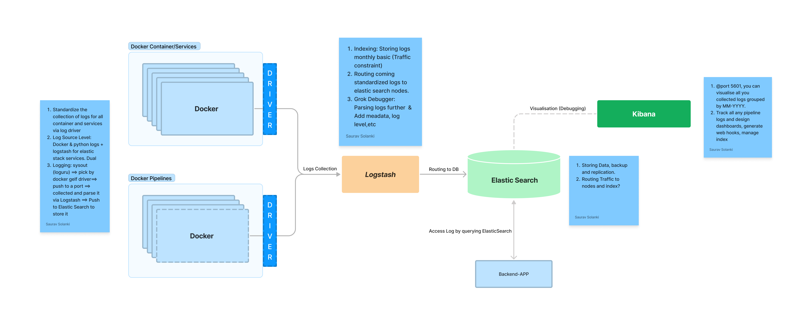

# FastAPI and Elastic stack (ELK) on Docker

This is a template repo for fast-api user interested to build application and serve nicely with elastic stacks.

### Dependencies

* Docker version 20.10.17, build 100c701
* docker-compose version 1.29.2, build 5becea4c
* Distributor ID: Ubuntu ,Description: Ubuntu 22.04.1 LTS ,Release: 22.04 , Codename: jammy

### Installing

* Run the latest version of the code with Docker and Docker Compose:

* Run FastAPI + ELK: `docker-compose -f docker-compose.yml -f webapp/webapp-compose.yml up --build -d`

* Stop the containers: `docker-compose down`

### Executing program
  By default, the stack exposes the following ports:

    <Ports>: <Service>
    9200/9300: Elastic Search
    5044/5000/9600: Logstash
    5555: Kibana
    5008: Webapp
    12201: Logstash_log_port

All the variables is in .env and this will be picked by docker and fastapi.

## Diagram

## Authors
* [Saurav Solanki](https://github.com/sauravsolanki)

## Version History
* 0.0.1 : Initial Release

## License
This project is licensed under the Saurav Solanki License - see the LICENSE.md file for details

## Acknowledgments
1. [docker-elk](https://github.com/deviantony/docker-elk/workflows/CI/badge.svg?branch=main)
2. [Elastic Search](https://www.elastic.co/)
3. [fastapi](https://fastapi.tiangolo.com/)